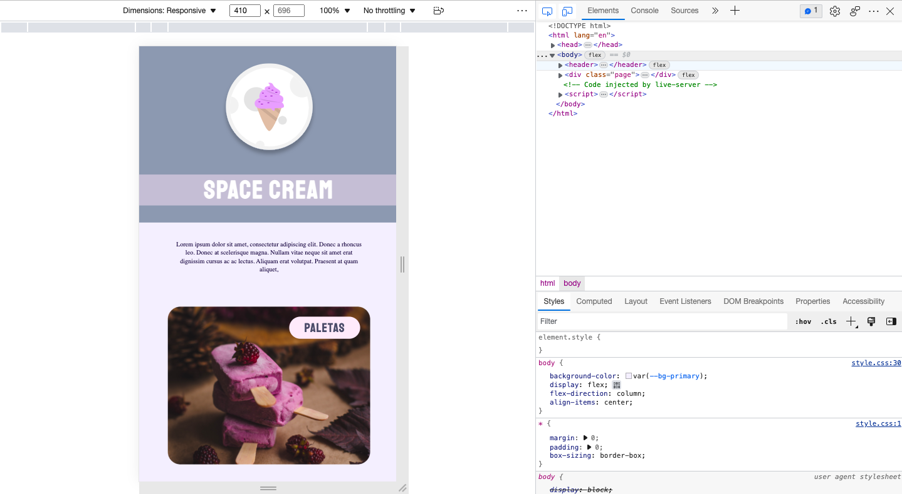

<h1 align="center"> Mobile First - Space Cream </h1>

  <a href="#-tecnologias">Technology</a>&nbsp;&nbsp;&nbsp;|&nbsp;&nbsp;&nbsp;
  <a href="#-projeto">Project</a>&nbsp;&nbsp;&nbsp;|&nbsp;&nbsp;&nbsp;
  <a href="#-layout">Layout</a>&nbsp;&nbsp;&nbsp;|&nbsp;&nbsp;&nbsp;
  <a href="#memo-licença">License</a>

 

  

## 🚀 Technology

This project was developed with the technologies below:

- HTML and CSS
- Git and Github
- Figma

## 💻 Project

This project was made for mobile devices and show a bit of css @keyframes  

## Figma

https://www.figma.com/file/drBBktNRdtCIUiN4cZk4yo/Stage-03---Mobile-First?node-id=12%3A137&t=IciInOApRBCF7VvK-0

## Link

## :memo: License

This project is above the MIT license.

---

 Made  ♥  by Gustavo Zonta
