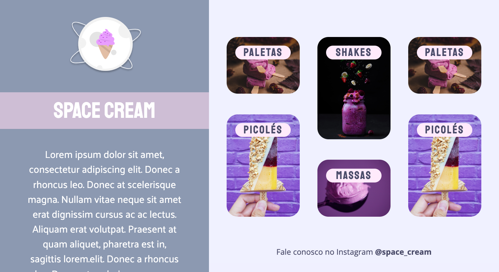

<h1 align="center"> Grid with animations - Space Cream </h1>

  <a href="#-tecnologias">Technology</a>&nbsp;&nbsp;&nbsp;|&nbsp;&nbsp;&nbsp;
  <a href="#-projeto">Project</a>&nbsp;&nbsp;&nbsp;|&nbsp;&nbsp;&nbsp;
  <a href="#-layout">Layout</a>&nbsp;&nbsp;&nbsp;|&nbsp;&nbsp;&nbsp;
  <a href="#memo-licença">License</a>

 

  

## 🚀 Technology

This project was developed with the technologies below:

- HTML and CSS
- Git and Github
- Figma

## 💻 Project

This is a responsive project for mobile device and desktop. It was make with grid and animations such as slide the span of the images, slide the images.  

## Figma Link

<a href="https://www.figma.com/file/pIdQBriW6ktJghGQSSaPXo/Stage-03---Grid-com-anima%C3%A7%C3%B5es-(Copy)?node-id=0%3A3&t=nJsIHvVJ8d93b7sJ-0" target="_blank"> Click here </a>

## :memo: License

This project is above the MIT license.

---

 Made  ♥  by Gustavo Zonta
